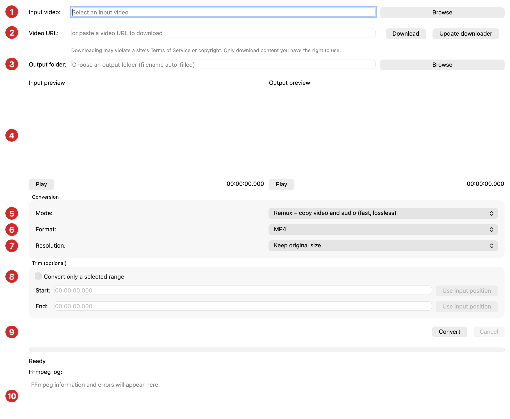

# Amrut Audio Video Converter

A Windows and macOS desktop application for converting, previewing, trimming, and
downloading video — and extracting audio. It is a GUI front end for **FFmpeg**
built with **PySide6 (Qt)**: the app inspects your video with `ffprobe`, builds
the correct FFmpeg command, runs it in the background, and shows live progress.
It never encodes video itself.

_Copyright © 2026 Harikrishna Ranpariya._

## App at a glance



1. **Input video** — click **Browse** to pick a local file to convert.
2. **Video URL** — paste a link, click **Download** (choose a folder), and convert
   it. **Update downloader** keeps the download engine (yt-dlp) current.
3. **Output folder** — **Browse** to choose where results are saved; the filename
   is auto-filled from the input and format.
4. **Input / Output preview** — play the source (left) and the finished result
   (right); use Play/Pause and the seek slider.
5. **Mode** — the conversion recipe: Remux, H.264/AAC, H.265/AAC, VP9/Opus,
   ProRes/PCM, or Extract MP3 audio.
6. **Format** — the output container (MP4/MOV/MKV/WebM/MP3); only valid choices
   for the selected mode are shown.
7. **Resolution** — keep the original size or downscale (2160p → 480p).
8. **Trim (optional)** — tick to convert only a selected range; capture Start/End
   from the input preview.
9. **Convert / Cancel** — start or stop the conversion.
10. **FFmpeg log** — live progress and the raw FFmpeg messages.

See the [User Guide](docs/USER_GUIDE.md) for step-by-step instructions.

## Features

- Convert to **MP4, MOV, MKV, WebM**.
- Conversion modes: **Remux** (lossless copy), **H.264/AAC**, **H.265/AAC**,
  **VP9/Opus**, **ProRes/PCM**.
- **Extract MP3 audio** (drop the video track).
- **In-app video preview** of both the input and the converted output.
- **Download from a URL** (YouTube and many sites) via a self-updating yt-dlp
  (**Update downloader** button), then convert.
- **Trim**: convert only a selected portion of the video, capturing start/end
  from the preview playhead.
- Optional **downscaling** (2160p → 480p).
- **Folder pickers** for output and downloads (defaults: Windows Videos /
  macOS Movies), with last-used folder remembered.
- **Remux safety check**: blocks incompatible copies and offers a one-click
  “Convert to MP4 (H.264/AAC)” instead.
- Live progress bar, full FFmpeg log, and cancel support.

## Documentation

| Doc | Purpose |
|-----|---------|
| [docs/USER_GUIDE.md](docs/USER_GUIDE.md) | How to use the application. |
| [docs/FORMATS.md](docs/FORMATS.md) | Container/codec architecture and valid combinations. |
| [docs/ALGORITHMS.md](docs/ALGORITHMS.md) | How remux and transcode conversions work. |
| [docs/URL_DOWNLOAD.md](docs/URL_DOWNLOAD.md) | URL download → convert flow and architecture. |
| [.github/skills/video-conversion/](.github/skills/video-conversion/SKILL.md) | Agent skill: deep FFmpeg/codec knowledge for extending the app. |

## Architecture

The app is a thin Qt GUI over separated, testable modules.

```
app.py                      # Entry point: QApplication + MainWindow
videoconverter/
├── ffmpeg.py               # Tool discovery + ffprobe inspection (no Qt)
├── profiles.py             # FORMATS/PROFILES + argument builder + remux checks (no Qt)
├── conversion.py           # ConversionController: QProcess + progress parsing
├── downloader.py           # yt-dlp URL download + self-update (QThread workers)
├── preview.py              # VideoPreview widget (Qt Multimedia)
└── main_window.py          # Layout and wiring
bin/                        # Bundled ffmpeg / ffprobe (+ optional ffplay)
docs/                       # User + format + algorithm + download documentation
```

Design principles:

- **Separation of concerns** — media logic (`ffmpeg.py`, `profiles.py`) is Qt-free
  and unit-testable; only `main_window.py`/`preview.py` touch widgets.
- **Data-driven** — adding a codec/format means editing the `PROFILES`/`FORMATS`
  registries in `profiles.py`, not the UI.
- **Non-blocking** — FFmpeg runs via `QProcess`, keeping the UI responsive.

See [architecture reference](.github/skills/video-conversion/references/architecture.md)
for extension points.

## Requirements

- **Windows** and **macOS** are both supported targets (Linux runs from source).
- FFmpeg binaries in `bin/`, named per platform. Both sets can coexist:
  - Windows: `bin/ffmpeg.exe`, `bin/ffprobe.exe`
  - macOS/Linux: `bin/ffmpeg`, `bin/ffprobe` (no extension, and executable)
- Qt Multimedia plugins for in-app preview (bundled by PyInstaller; the app still
  converts without them).

> Use **static** FFmpeg builds so the bundled app runs on machines without
> Homebrew/system libraries. On macOS a Homebrew `ffmpeg` depends on Homebrew
> dylibs and may not run when copied into another machine's app bundle.

## FFmpeg setup (required before running or building)

The repository does **not** ship FFmpeg. Download the static binaries for your OS
and place them in the `bin/` folder with these exact names:

```
bin/
├── ffmpeg      (ffmpeg.exe  on Windows)
└── ffprobe     (ffprobe.exe on Windows)
```

**Windows** — download a static build, e.g. gyan.dev
(`ffmpeg-release-essentials.zip`) or BtbN. From its `bin` folder copy
`ffmpeg.exe` and `ffprobe.exe` into this project's `bin\`.

**macOS (Apple Silicon / arm64)** — download arm64 static builds from
osxexperts.net, then:

```bash
unzip ffmpeg*.zip -d bin && unzip ffprobe*.zip -d bin
chmod +x bin/ffmpeg bin/ffprobe
xattr -dr com.apple.quarantine bin/ffmpeg bin/ffprobe   # clear Gatekeeper flag
```

**macOS (Intel / x86_64)** — use evermeet.cx static builds; same placement/steps.

**Linux** — download static builds from johnvansickle.com; place `ffmpeg`/`ffprobe`
in `bin/` and `chmod +x` them.

Both Windows (`.exe`) and macOS/Linux (no extension) binaries may coexist in
`bin/`; the app and the PyInstaller spec pick the right ones per OS. CI downloads
these automatically — this manual step is only for local runs/builds.

## Run from source

Windows:

```bat
python -m venv venv
venv\Scripts\activate
python -m pip install -r requirements.txt
python app.py
```

macOS / Linux:

```bash
python3 -m venv venv
source venv/bin/activate
pip install -r requirements.txt
python app.py
```

Place the matching FFmpeg binaries in `bin/` first (see **FFmpeg setup** above).
On macOS/Linux mark them executable: `chmod +x bin/ffmpeg bin/ffprobe`.

## Build a native application

The same spec builds for whichever OS you run it on — it selects the correct
FFmpeg binaries and produces the right bundle type.

Windows (produces `dist/VideoConverter/VideoConverter.exe`):

```bat
pyinstaller VideoConverter.spec
```

macOS (produces `dist/VideoConverter.app`):

```bash
pyinstaller VideoConverter.spec
```

The spec bundles the platform's FFmpeg binaries and the Qt Multimedia plugins
needed for preview. UPX compression is applied on Windows only. Build on the
target OS — PyInstaller does not cross-compile.

### Step-by-step for a new developer

Do this on the OS you want to build for (Windows builds the `.exe`, macOS builds
the `.app`).

**Windows** (Command Prompt / PowerShell):

```bat
:: 1. Get the code
git clone https://github.com/HarikrishnaRanpariya/VideoConverter.git
cd VideoConverter

:: 2. Add FFmpeg (see "FFmpeg setup" above): put ffmpeg.exe and ffprobe.exe in bin\

:: 3. Create the environment and install dependencies
python -m venv venv
venv\Scripts\activate
python -m pip install -r requirements.txt

:: 4. (optional) run from source to test
python app.py

:: 5. Build the application
pyinstaller VideoConverter.spec
::   -> dist\VideoConverter\VideoConverter.exe
```

**macOS** (Terminal):

```bash
# 1. Get the code
git clone https://github.com/HarikrishnaRanpariya/VideoConverter.git
cd VideoConverter

# 2. Add FFmpeg (see "FFmpeg setup" above): put ffmpeg and ffprobe in bin/
chmod +x bin/ffmpeg bin/ffprobe
xattr -dr com.apple.quarantine bin/ffmpeg bin/ffprobe

# 3. Create the environment and install dependencies
python3 -m venv venv
source venv/bin/activate
pip install -r requirements.txt

# 4. (optional) run from source to test
python app.py

# 5. Build the application
pyinstaller VideoConverter.spec
#   -> dist/VideoConverter.app   (launch with: open dist/VideoConverter.app)
```

> `python build.py` does steps 4–5 with a prerequisite check, and prints where
> the artifact was written.

### Build helpers

- `python build.py` — verifies prerequisites, then builds for the current OS.
- `python build.py --check` — only checks that FFmpeg + PyInstaller are ready.
- `make install | run | test | build | clean` — convenience targets (macOS/Linux).
- **CI**: [.github/workflows/build.yml](.github/workflows/build.yml) builds Windows
  and macOS artifacts on native runners (downloading static FFmpeg automatically)
  and uploads them on every push/PR.

## Extending

1. Load the **video-conversion** skill (type `/` in chat, or it loads
   automatically) for codec/format guidance.
2. Add a `Profile` or `OutputFormat` to
   [videoconverter/profiles.py](videoconverter/profiles.py).
3. Verify the generated arguments by running FFmpeg on a short sample and
   re-probing the output with `ffprobe`.
